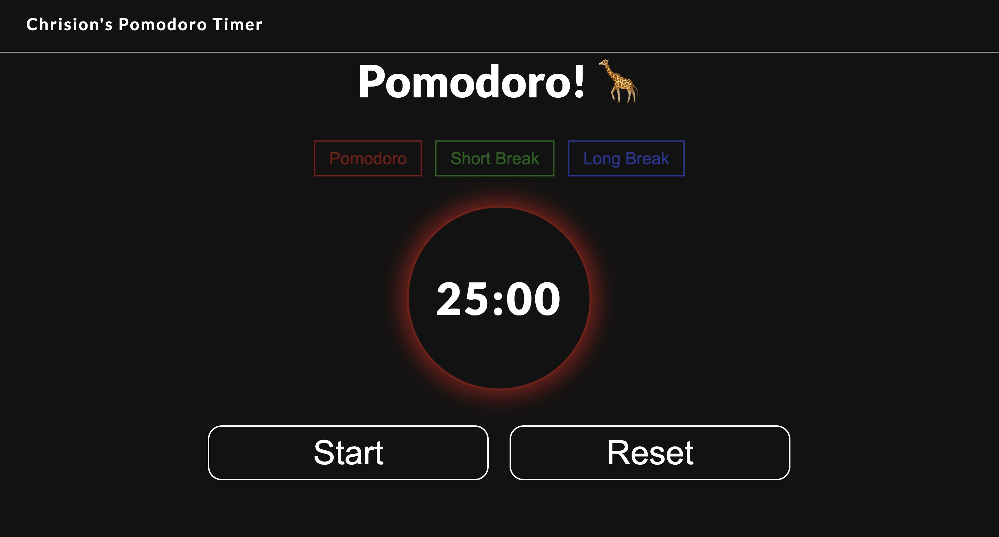

# ⏳ My-Personal-Pomodoro-Timer ⏳

A simple yet effective Pomodoro timer built to supercharge productivity during focused work sessions. Inspired by my own study habits, this timer helps track Pomodoro intervals with custom work, short break, and long break cycles. Whether you're coding, reading, or studying, this timer's gonna help you stay productive as long as you hold yourself accountable.

---

### 🚀 **Features**
- Customizable work and break modes.
- Sleek and responsive design for any device.
- Simple controls: Start, Pause, Reset.
- Visual timers to keep track of time effortlessly.

---

### 🎨 **Preview**

---

### 🌐 **Live Demo**
Check it out in action [here](https://clipzorama.github.io/My-Personal-Pomodoro-Timer/)!

---

### 📂 **Tech Stack**
- **HTML5**
- **CSS3**
- **JavaScript (ES6+)**

---

### 📋 **How to Use**
1. **Start** the timer for a 25-minute work session.
2. **Take a break**: 5-minute short break or 15-minute long break.
3. Rinse and repeat for optimal productivity!
