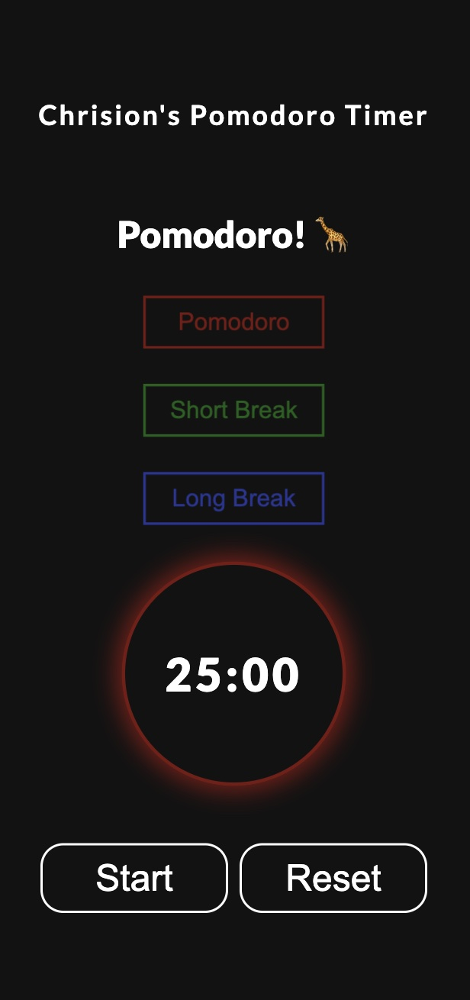

# My-Personal-Pomodoro-Timer
This Pomodoro Timer was inspired by my own study routine, as I frequently use the Pomodoro technique to stay focused. Built with HTML, CSS, and JavaScript, this timer helps manage work and break intervals effectively. A personal project designed to enhance productivity during study sessions.

### Screenshot

### Links

- Live Site URL: [My Personal Timer](https://clipzorama.github.io/My-Personal-Pomodoro-Timer/)
